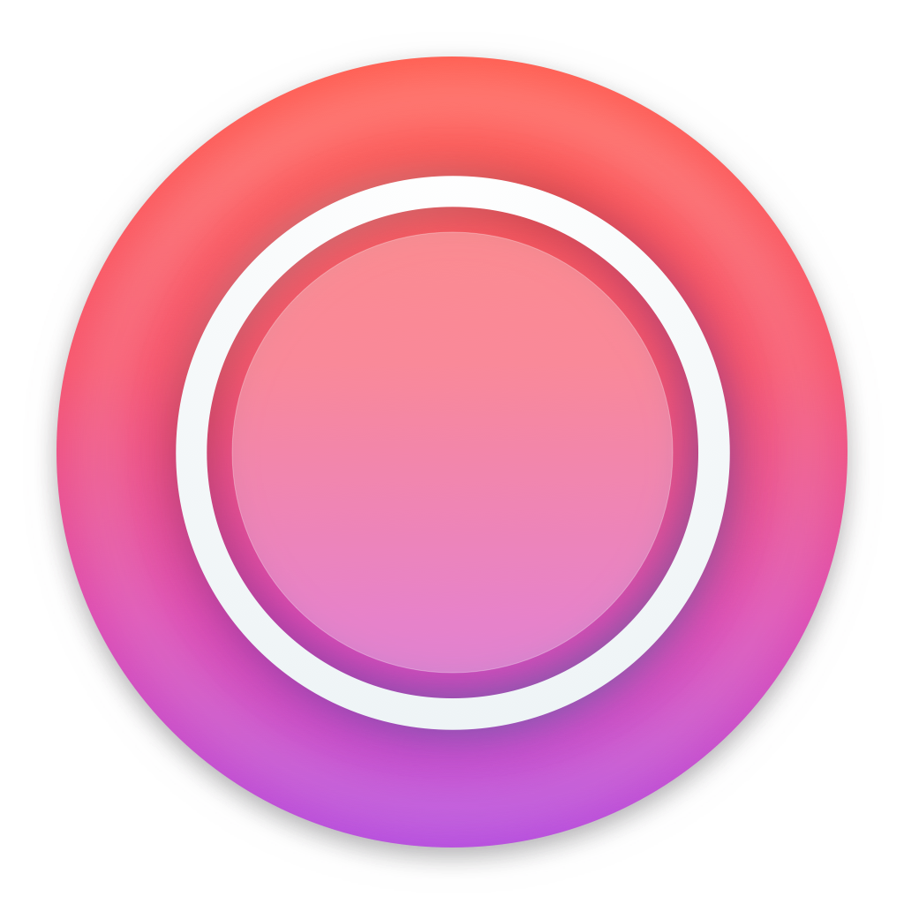

# Capture

   

Capture is a native macOS application to record your screen. What makes this application special is, that you can choose from a list of currently open windows and Capture will automatically set the recorded frame to the window frame. The application also works for multiple displays and gives you a handful of useful features concerning the export, quality of the recorded video and more. By default Capture will export to GIF. 

I wrote this application because at my workplace we often attach a GIF to a Pull Request in order to present a completed feature to the reviewers.

## See it in action

## Caveats
- You can only select an open window. The selected recording frame is not resizable. [👨‍💻 not released yet]
- Stopping a recording is not possible via a menu item [👨‍💻 not released yet]
- Currently only GIF export is allowed
- There is no way to specify audio sources

## Dependencies

| Dependency    | Are           |
| ------------- |:-------------:|
| Clipy/KeyHolder, Clipy/Magnet | Used to record shortcuts. |
| matthewpalmer/Regift     | Used to export a video as GIF. |
| mxcl/PromiseKit, PromiseKit/Foundation | Dependencies of AppUpdater which is currently not Carthage compatible. AppUpdater is used to provide automatic app updates. |
| dehlen/AboutWindowController | Not really a dependency since I own this one. AboutWindowController is used to show a nice Xcode-like About window. |

## Releasing
1. Update version in Xcode project
2. Tag new version in git repository
3. Create new GitHub release
4. Append signed .app to created release

## Support
If you find a bug or have an idea for an enhancement don't hesitate to file an issue. I am very grateful for every contribution you can make to improve Capture. You can help the most by providing a reproducible bug report or even better by filing a pull request to make sure Capture gets even better. I will do my best to help you with that if you need support. Please note that this application is at the moment free to use and fully open-source.

I also created an idea backlog to not pollute the issues section. All possible enhancements for Capture can be collected there. Feel free to add your own ideas [to the backlog](https://github.com/dehlen/Capture/projects/1). Once an idea is moved to "In Progress", I'll create an appropriate issue so you can better track the current state of the feature request. 

## Installation
Please go to https://captureapp.dev and download the latest version or simply go to the releases tab and download the version you want. If you have a macOS Developer account you can also build the application from source of course.

## Build
To setup the project just run rake setup. This will install all the needed dependencies. After that you can open the Xcode project. There is also rake setup_with_unit_test which executes the unit tests after installing the needed tools. 

Furthermore the project will run [SwiftLint](https://github.com/realm/SwiftLint) as a Custom Build Phase. We also make use of [fastlane](https://fastlane.tools) to run the unit test target.

## Alternatives
- QuickTime
- [Kap](https://getkap.co)
